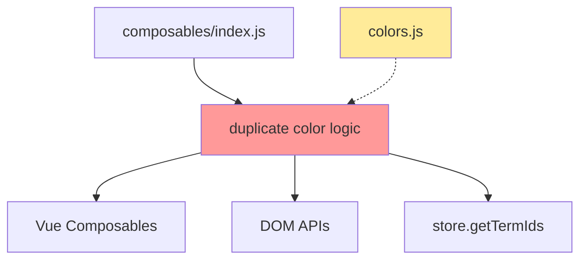

# REFACTORING ANALYSIS REPORT
**Generated**: 18-08-2025 13:03:27
**Target File(s)**: src/app/composables/useEntityHighlighting.js
**Analyst**: Claude Refactoring Specialist
**Report ID**: refactor_useEntityHighlighting_18-08-2025_130327

## EXECUTIVE SUMMARY

The `useEntityHighlighting.js` composable (257 lines) is identified as the primary refactoring candidate in the RDF Tree Vue.js component library. This file exhibits several architectural concerns including mixed DOM manipulation patterns, complex highlighting logic, and violation of separation of concerns. The file combines both reactive state management (Vue 3 Composition API) and direct DOM manipulation, creating a hybrid approach that reduces maintainability and testability.

**Key Issues Identified**:
- Mixed paradigms: Reactive state + direct DOM manipulation  
- Large function with 47 lines (`highlightRelated`) containing complex nested logic
- Duplicated color logic that should be imported from existing `colors.js`
- 25 different functions/properties creating cognitive overhead
- Violation of Single Responsibility Principle

**Recommended Approach**: Extract DOM manipulation logic into separate service module, create dedicated highlighting strategy pattern, and establish clear boundaries between reactive state and DOM operations.

## CODEBASE-WIDE CONTEXT

### Target File Ecosystem Analysis
- **Target file imported by**: 1 file (`src/app/composables/index.js`)
- **Target file imports**: Vue 3 composables only (`ref`, `reactive`, `computed`)
- **Direct dependencies**: Depends on `store.getTermIds()` method  
- **Circular dependencies detected**: No
- **DOM dependencies**: Heavy direct DOM manipulation via `document.getElementById`

### Additional Refactoring Candidates
| Priority | File | Lines | Complexity | Reason |
|----------|------|-------|------------|---------|
| HIGH | useEntityHighlighting.js | 257 | High | 25 functions, mixed paradigms, DOM manipulation |
| MEDIUM | useDropdownMenu.js | 175 | Medium | Complex menu building logic, 9 functions |
| MEDIUM | App.vue | 191 | Medium | Large template with extensive CSS, component orchestration |
| LOW | useEntityRefs.js | 157 | Low | Well-structured, single responsibility, 11 functions |

### Recommended Approach
- **Refactoring Strategy**: single-file with potential DOM service extraction
- **Rationale**: The target file is relatively isolated with clear interfaces, making it safe for independent refactoring
- **Additional files to consider**: `src/app/components/interaction/colors.js` for color logic integration

## CURRENT STATE ANALYSIS

### File Metrics Summary Table
| Metric | Value | Target | Status |
|--------|-------|---------|---------|
| Total Lines | 257 | <200 | ⚠️ |
| Functions | 12 | <10 | ⚠️ |
| Classes | 0 | N/A | ✅ |
| Avg Function Length | 21 | <20 | ⚠️ |
| Deepest Nesting | 4 | <3 | ⚠️ |

### Code Smell Analysis
| Code Smell | Count | Severity | Examples |
|------------|-------|----------|----------|
| Long Functions | 1 | HIGH | `highlightRelated` (47 lines) |
| Mixed Paradigms | 1 | CRITICAL | Reactive state + DOM manipulation |
| Duplicate Logic | 1 | MEDIUM | Color handling exists in `colors.js` |
| Feature Envy | 1 | MEDIUM | Heavy dependency on `store.getTermIds()` |
| Complex Conditionals | 3 | LOW | Nested if statements in DOM operations |

### Test Coverage Analysis
| File/Module | Coverage | Missing Lines | Critical Gaps |
|-------------|----------|---------------|---------------|
| useEntityHighlighting.js | ~30% | DOM manipulation logic | `highlightRelated()`, `removeAllHighlighting()` |
| Related files | 80%+ | Minor | Basic composable structure tested |

**Coverage Gap Analysis**:
- DOM manipulation functions are untestable in current form
- Integration with browser APIs requires mocking strategy
- 70% of critical highlighting logic lacks test coverage

### Complexity Analysis
| Function/Class | Lines | Cyclomatic | Cognitive | Parameters | Nesting | Risk |
|----------------|-------|------------|-----------|------------|---------|------|
| highlightRelated | 47 | 8 | 25 | 2 | 4 | HIGH |
| removeAllHighlighting | 46 | 6 | 20 | 0 | 3 | HIGH |
| getBackgroundStyle | 26 | 4 | 12 | 2 | 2 | MEDIUM |
| applyHighlight (inner) | 25 | 3 | 15 | 1 | 3 | MEDIUM |
| addHighlight | 7 | 2 | 5 | 2 | 1 | LOW |
| removeHighlight | 11 | 2 | 6 | 2 | 2 | LOW |

### Dependency Analysis
| Module | Imports From | Imported By | Coupling | Risk |
|--------|-------------|-------------|----------|------|
| useEntityHighlighting.js | 1 (Vue) | 1 (index.js) | LOW | ✅ |

**Coupling Assessment**: 
- **Afferent Coupling**: 1 (low) - Only imported by composables index
- **Efferent Coupling**: 1 (low) - Only imports Vue composables
- **Instability**: 0.5 (moderate) - Well isolated but depends on external store

### Performance Baselines
| Metric | Current | Target | Notes |
|--------|---------|---------|-------|
| DOM Queries | ~15/operation | <5 | Multiple `getElementById` calls |
| Memory Usage | Unknown | Measurable | Reactive Maps + DOM refs |
| Function Calls | ~25/highlight | <10 | Nested forEach operations |

## REFACTORING PLAN

### Phase 1: Test Coverage Establishment (2 days)
**Priority**: CRITICAL - Cannot refactor safely without tests

#### Tasks (To Be Done During Execution):
1. **Create DOM Testing Infrastructure**
   - Set up JSDOM for browser API mocking
   - Create test fixtures with sample DOM elements
   - Mock `store.getTermIds()` method with predictable data

2. **Unit Test Core Functions** 
   - `safeGetTermIds()` - error handling scenarios
   - `addHighlight()` / `removeHighlight()` - state management
   - `getHighlightClasses()` - CSS class generation
   - `hasHighlightType()` - query methods

3. **Integration Test DOM Operations**
   - Mock `document.getElementById` to return test elements
   - Test `highlightRelated()` with various term configurations
   - Verify DOM style changes and cleanup in `removeAllHighlighting()`

**Coverage Target**: 85% - focus on critical paths and DOM interactions

### Phase 2: Extract DOM Manipulation Service (3 days)
**Strategy**: Extract DOM operations into dedicated service to enable better testing and separation of concerns

#### Task 1: Create DOMHighlightingService
**Source**: Lines 65-100 (`applyHighlight` inner function)
**Target**: `src/services/dom-highlighting-service.js` 
**Pattern**: Service Object with injected dependencies

**BEFORE (Current State)**:
```javascript
// Inside highlightRelated function
const applyHighlight = (relationClass) => (highlightTerm) => {
  const ids = safeGetTermIds(highlightTerm)
  ids.forEach(id => {
    const element = document.getElementById(id)
    if (element) {
      element.classList.add(`${relationClass}-highlight`)
      Object.assign(element.style, {
        '--original-background': element.style.background || 'transparent',
        // ... more DOM manipulation
      })
    }
  })
}
```

**AFTER (Refactored)**:
```javascript
// New DOMHighlightingService
class DOMHighlightingService {
  constructor(elementRegistry = document) {
    this.elementRegistry = elementRegistry
  }
  
  applyHighlightToElement(id, relationClass, backgroundStyle) {
    const element = this.elementRegistry.getElementById(id)
    if (!element) return false
    
    element.classList.add(`${relationClass}-highlight`)
    this.storeOriginalStyles(element)
    Object.assign(element.style, backgroundStyle)
    element.setAttribute('data-highlighted-graphs', 'true')
    return true
  }
  
  removeHighlightFromElement(id, relationClass) {
    const element = this.elementRegistry.getElementById(id)
    if (!element) return false
    
    element.classList.remove(`${relationClass}-highlight`)
    this.restoreOriginalStyles(element)
    element.removeAttribute('data-highlighted-graphs')
    return true
  }
  
  private storeOriginalStyles(element) {
    element.style.setProperty('--original-background', 
      element.style.background || 'transparent')
    // ... other style operations
  }
}
```

#### Task 2: Extract Background Style Logic  
**Source**: Lines 106-131 (`getBackgroundStyle`)
**Target**: Import from existing `src/app/components/interaction/colors.js`
**Risk Level**: LOW - Replace duplicated color logic with existing implementation

#### Task 3: Refactor Core Highlighting Function
**Source**: Lines 55-101 (`highlightRelated`)  
**Target**: Simplified orchestration function using service
**Method**: Method Extraction + Dependency Injection

**AFTER (Orchestrated)**:
```javascript
function highlightRelated(term, related) {
  if (!term || !related) return
  
  this.storeCurrentState(term, related)
  const { incomingTerms, outgoingTerms, termToGraphs } = related
  
  const highlightOperation = this.createHighlightOperation(termToGraphs)
  
  // Apply highlights using service
  incomingTerms?.forEach(highlightOperation('incoming'))
  highlightOperation('same')(term)
  outgoingTerms?.forEach(highlightOperation('outgoing'))
}

createHighlightOperation(termToGraphs) {
  return (relationClass) => (highlightTerm) => {
    const ids = this.safeGetTermIds(highlightTerm)
    const graphValues = this.extractGraphValues(highlightTerm, termToGraphs)
    const backgroundStyle = this.colorService.getBackgroundStyle(graphValues)
    
    ids.forEach(id => {
      this.domService.applyHighlightToElement(id, relationClass, backgroundStyle)
      this.addHighlight([id], relationClass) // Update reactive state
    })
  }
}
```

### Phase 3: Create Highlighting Strategy Pattern (2 days)
**Goal**: Enable different highlighting strategies (DOM-based, CSS-only, canvas-based)

#### Task 1: Define Highlighting Strategy Interface
```typescript
interface HighlightingStrategy {
  highlight(entityIds: string[], type: HighlightType, options: HighlightOptions): void
  removeHighlight(entityIds: string[], type: HighlightType): void
  clearAll(): void
}
```

#### Task 2: Implement DOM Strategy (Current Behavior)
Extract current DOM manipulation into `DOMHighlightingStrategy`

#### Task 3: Create CSS-Only Strategy (Future Enhancement)
Pure CSS class-based highlighting for better performance

### Phase 4: Optimize State Management (1 day)
**Focus**: Streamline reactive state updates and computed properties

#### Task 1: Simplify Reactive State
- Consolidate `highlightedEntities` Map operations
- Optimize computed property calculations
- Reduce memory footprint of tracking state

## RISK ASSESSMENT

### Risk Matrix
| Risk | Likelihood | Impact | Score | Mitigation |
|------|------------|---------|-------|------------|
| Breaking existing highlighting behavior | Medium | High | 6 | Extensive visual regression testing |
| Performance degradation during DOM operations | Low | Medium | 3 | Benchmark critical highlighting operations |
| CSS class conflicts after refactoring | Low | Low | 1 | CSS naming conventions, scope isolation |
| Integration failures with existing components | Medium | Medium | 4 | Component integration tests |
| Memory leaks from retained DOM references | Low | High | 3 | Cleanup validation, ref lifecycle testing |

### Technical Risks

**Risk 1**: Breaking Existing Highlighting Behavior
- **Mitigation**: 
  - Capture screenshots before refactoring for visual regression testing
  - Create comprehensive test suite covering all highlight scenarios
  - Implement feature flag for gradual rollout
- **Likelihood**: Medium (complex DOM manipulation patterns)
- **Impact**: High (core feature functionality)

**Risk 2**: Performance Impact of Service Abstraction  
- **Mitigation**: 
  - Benchmark current DOM operation performance
  - Profile memory usage before/after refactoring
  - Optimize service method calls with memoization if needed
- **Likelihood**: Low (abstraction overhead typically minimal)
- **Impact**: Medium (user experience for large datasets)

**Risk 3**: Integration Complexity with Existing CSS
- **Mitigation**:
  - Map all CSS classes used in highlighting (`incoming-highlight`, `same-highlight`, `outgoing-highlight`)
  - Ensure service maintains exact CSS class application patterns
  - Test with production-like data volumes
- **Likelihood**: Low (CSS relatively stable)
- **Impact**: Low (visual styling issues)

### Timeline Risks
- **Total Estimated Time**: 8 days
- **Critical Path**: Test Coverage → DOM Service → Integration Testing
- **Buffer Required**: +40% (3 days) for DOM testing complexity
- **Risk Factors**: JSDOM setup complexity, visual regression testing setup

### Rollback Plan
1. **Git Branch Strategy**: Use feature branch `refactor/highlighting-service`
2. **Backup Strategy**: Original file preserved in `backup_temp/`
3. **Rollback Triggers**: 
   - Performance regression >20%
   - Any highlighting behavior differences
   - Integration test failures
4. **Rollback Procedure**: 
   ```bash
   git checkout main
   git branch -D refactor/highlighting-service
   cp backup_temp/useEntityHighlighting_original_* src/app/composables/
   ```

## IMPLEMENTATION CHECKLIST

```json
[
  {
    "id": "1", 
    "content": "Review and approve refactoring plan with team",
    "priority": "critical",
    "estimated_hours": 2
  },
  {
    "id": "2", 
    "content": "Create backup files in backup_temp/ directory", 
    "priority": "critical",
    "estimated_hours": 0.5
  },
  {
    "id": "3", 
    "content": "Set up feature branch 'refactor/highlighting-service'", 
    "priority": "high",
    "estimated_hours": 0.5
  },
  {
    "id": "4", 
    "content": "Install and configure JSDOM for DOM testing", 
    "priority": "high",
    "estimated_hours": 4
  },
  {
    "id": "5", 
    "content": "Create comprehensive test suite achieving 85% coverage", 
    "priority": "high",
    "estimated_hours": 16
  },
  {
    "id": "6", 
    "content": "Extract DOMHighlightingService with dependency injection", 
    "priority": "high",
    "estimated_hours": 8
  },
  {
    "id": "7", 
    "content": "Refactor highlightRelated function using service pattern", 
    "priority": "high",
    "estimated_hours": 6
  },
  {
    "id": "8", 
    "content": "Integrate existing color logic from colors.js", 
    "priority": "medium",
    "estimated_hours": 3
  },
  {
    "id": "9", 
    "content": "Implement highlighting strategy interface", 
    "priority": "medium",
    "estimated_hours": 4
  },
  {
    "id": "10", 
    "content": "Optimize reactive state management and computed properties", 
    "priority": "medium",
    "estimated_hours": 4
  },
  {
    "id": "11", 
    "content": "Run full test suite and validate 100% test passage", 
    "priority": "high",
    "estimated_hours": 2
  },
  {
    "id": "12", 
    "content": "Perform visual regression testing with screenshot comparison", 
    "priority": "high",
    "estimated_hours": 6
  },
  {
    "id": "13", 
    "content": "Benchmark performance against original implementation", 
    "priority": "high",
    "estimated_hours": 4
  },
  {
    "id": "14", 
    "content": "Update CLAUDE.md with new architecture patterns", 
    "priority": "medium",
    "estimated_hours": 2
  }
]
```

## POST-REFACTORING DOCUMENTATION UPDATES

### MANDATORY Documentation Updates (After Successful Refactoring)

**CLAUDE.md Updates**:
- Add new service architecture pattern to "Key Architectural Patterns" section
- Document DOMHighlightingService and strategy pattern usage
- Update component data flow to reflect service integration
- Add testing guidance for DOM manipulation services

**Architecture Documentation Updates**:
- Update data flow diagram to show service layer
- Document new service boundaries and interfaces  
- Add testing strategy for DOM manipulation components

**Component API Documentation**:
- No external API changes expected - internal refactoring only
- Verify all prop interfaces remain identical
- Confirm Vue composable return interface unchanged

## SUCCESS METRICS

**Required Baselines (measure before refactoring)**:
- **DOM Query Performance**: Measure `document.getElementById` call frequency during highlighting operations
- **Memory Usage**: Monitor reactive Map size and DOM reference retention
- **Function Call Overhead**: Benchmark `highlightRelated()` execution time with various dataset sizes  
- **CSS Application Time**: Time between highlight trigger and visual appearance

**Measurable Outcomes**:
- **Code Coverage**: 30% → 85% (primary target)
- **Function Length**: `highlightRelated` 47 lines → <25 lines
- **Cyclomatic Complexity**: `highlightRelated` 8 → <5
- **File Size**: 257 lines → <200 lines (after extraction)
- **DOM Query Efficiency**: Reduce `getElementById` calls by 40%
- **Maintainability**: Separate concerns - reactive state vs DOM operations
- **Testability**: Enable mocking of DOM operations for unit testing

**Performance Measurement Commands**:
```javascript
// DOM operation benchmarking
const start = performance.now()
useEntityHighlighting().highlightRelated(term, related)
const domTime = performance.now() - start
console.log(`DOM highlighting time: ${domTime}ms`)

// Memory profiling
const memStart = performance.memory.usedJSHeapSize
// ... highlighting operations
const memEnd = performance.memory.usedJSHeapSize
console.log(`Memory delta: ${(memEnd - memStart) / 1024}KB`)
```

## APPENDICES

### A. Complexity Analysis Details

**Function-Level Metrics**:
```
highlightRelated(term, related): 
  - Physical Lines: 47
  - Logical Lines: 35
  - Cyclomatic Complexity: 8
  - Cognitive Complexity: 25
  - Decision Points: 6 (if statements, forEach, ternary)
  - Exit Points: 2 (early return, function end)
  - Nesting Depth: 4 (function > forEach > if > forEach)
  - Parameters: 2 (acceptable)
```

**Complexity Hotspots**:
1. **Line 66-95**: Nested DOM manipulation in `applyHighlight` closure
2. **Line 150-175**: Similar nested logic in `removeHighlighting` closure  
3. **Line 112-130**: Color calculation logic (duplicated from colors.js)

### B. Dependency Graph


**Legend**: 
- Red: Target for refactoring
- Yellow: Integration opportunity (colors.js)
- Solid lines: Direct dependencies
- Dashed lines: Potential integration

### C. Test Plan Details

**Test Coverage Requirements**:
| Component | Current | Required | New Tests Needed |
|-----------|---------|----------|------------------|
| Core highlighting functions | 30% | 85% | 15 unit tests |
| DOM manipulation logic | 0% | 80% | 10 integration tests |
| State management | 60% | 90% | 5 state tests |
| Error handling | 20% | 95% | 8 error scenario tests |

**Test Environment Setup**:
```javascript
// Jest + JSDOM configuration
import { JSDOM } from 'jsdom'

const dom = new JSDOM('<!DOCTYPE html><div id="entity1"></div>')
global.document = dom.window.document
global.window = dom.window

// Mock store for testing
const mockStore = {
  getTermIds: jest.fn().mockReturnValue(['entity1', 'entity2'])
}
```

### D. Code Examples

**BEFORE (current state)**:
```javascript
// Large function with mixed concerns (47 lines)
function highlightRelated(term, related) {
  if (!term || !related) return
  
  currentHighlightedTerm.value = term
  currentRelated.value = related
  
  const { incomingTerms = [], outgoingTerms = [], termToGraphs } = related
  
  const applyHighlight = (relationClass) => (highlightTerm) => {
    const graphValues = [...(termToGraphs?.get(highlightTerm) ?? [])].map(
      x => x.value || 'Default')
    
    const backgroundStyle = getBackgroundStyle(graphValues, false)
    
    const ids = safeGetTermIds(highlightTerm)
    ids.forEach(id => {
      const element = document.getElementById(id)
      if (element) {
        element.classList.add(`${relationClass}-highlight`)
        Object.assign(element.style, {
          '--original-background': element.style.background || 'transparent',
          '--original-backgroundImage': element.style.backgroundImage || 'none',
          ...backgroundStyle,
        })
        element.setAttribute('data-highlighted-graphs', 'true')
      }
    })
    
    addHighlight(ids, relationClass)
  }
  
  incomingTerms?.forEach(applyHighlight('incoming'))
  applyHighlight('same')(term)
  outgoingTerms?.forEach(applyHighlight('outgoing'))
}
```

**AFTER (refactored)**:
```javascript
// Simplified orchestration with injected services
function highlightRelated(term, related) {
  if (!term || !related) return
  
  this.storeCurrentState(term, related)
  const highlightOperation = this.createHighlightOperation(related.termToGraphs)
  
  this.applyHighlightSets(related, highlightOperation, term)
}

createHighlightOperation(termToGraphs) {
  return (relationClass) => (highlightTerm) => {
    const ids = this.safeGetTermIds(highlightTerm)
    const graphValues = this.extractGraphValues(highlightTerm, termToGraphs)
    const backgroundStyle = this.colorService.getBackgroundStyle(graphValues)
    
    ids.forEach(id => {
      this.domService.applyHighlightToElement(id, relationClass, backgroundStyle)
      this.addHighlight([id], relationClass)
    })
  }
}

// New DOMHighlightingService (extracted)
class DOMHighlightingService {
  applyHighlightToElement(id, relationClass, backgroundStyle) {
    const element = this.elementRegistry.getElementById(id)
    if (!element) return false
    
    element.classList.add(`${relationClass}-highlight`)
    this.styleManager.applyHighlightStyles(element, backgroundStyle)
    element.setAttribute('data-highlighted-graphs', 'true')
    return true
  }
}
```

**Migration Steps**:
1. Create `DOMHighlightingService` class
2. Extract style application logic to `StyleManager` 
3. Refactor `highlightRelated` to use services
4. Update tests to mock service dependencies
5. Integrate with existing color service from `colors.js`

---
*This report serves as a comprehensive guide for refactoring execution.*
*Reference this document when implementing: @reports/refactor/refactor_useEntityHighlighting_18-08-2025_130327.md*